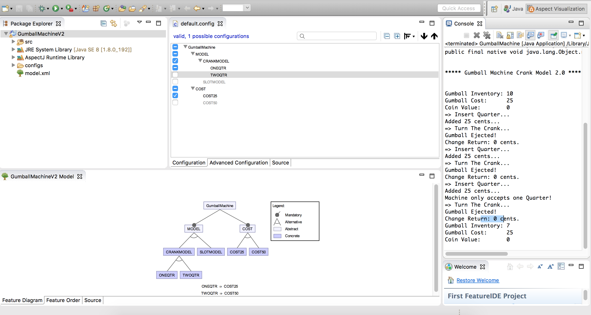
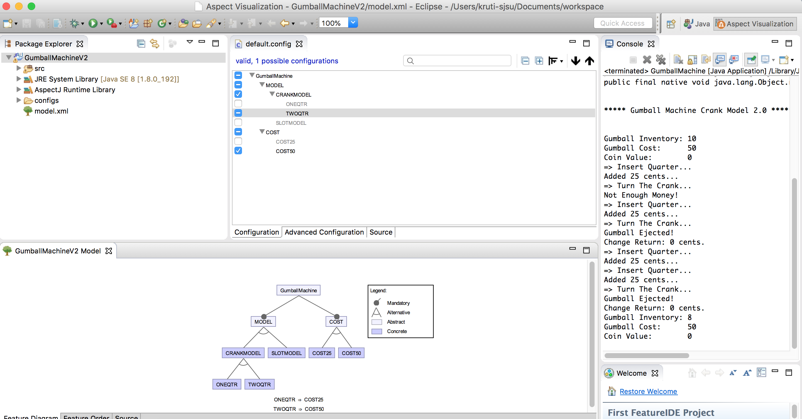
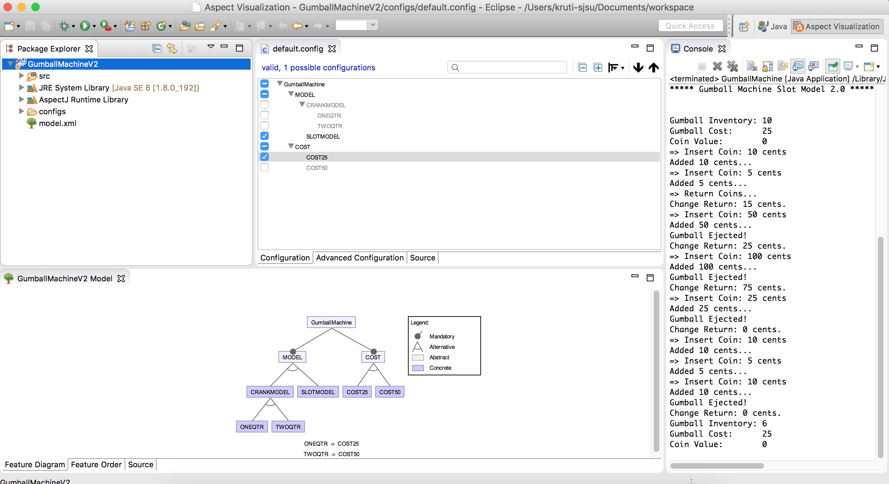
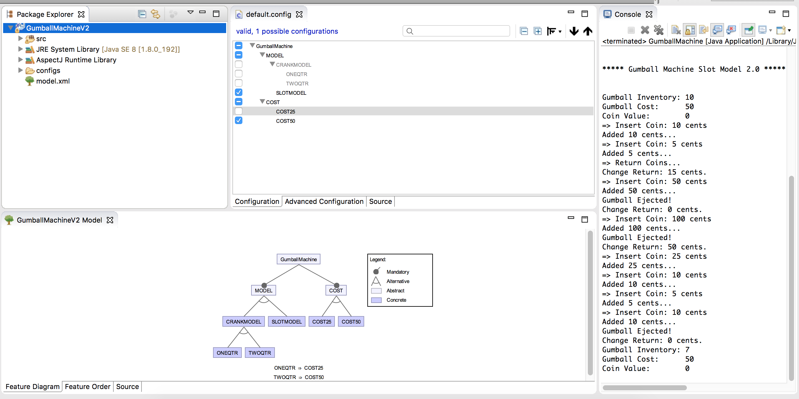

# Summary
### By using AspectJ for the gumball problem, the code is made simpler and easier to manage. Instead of using derived classes to implement various versions of the gumball machine, with AspectJ we could change the structure of a class at compile time by changing the config file i.e we could add to our classes at compile time. This is a powerful feature when it comes to implementing varied models that can be config driven.It helps in keeping the business logic separated from other cross-cutting concerns like system-level concerns.

The config for crank machine model for 25 cent is as below

The config for crank machine model for 50 cent machine is as below

The config for slot machine  model for 25 cent is as below

The config for slot machine model for 50 cent is as below

